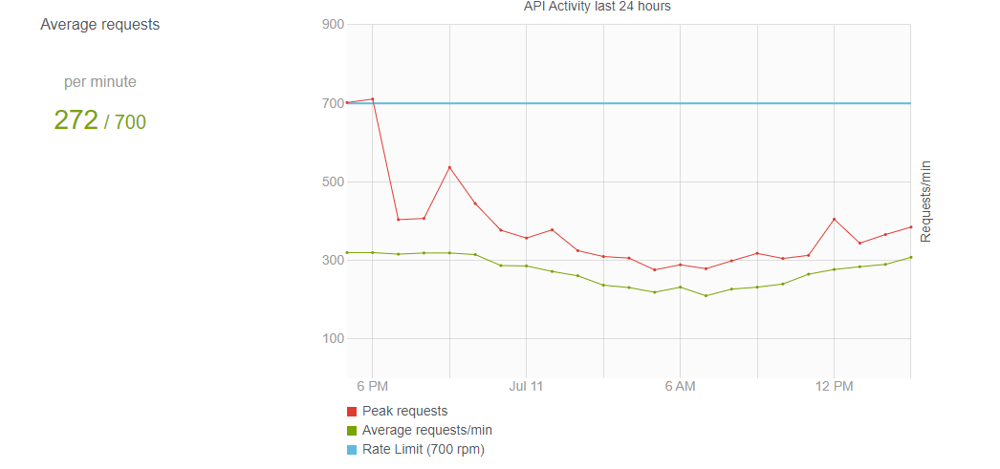
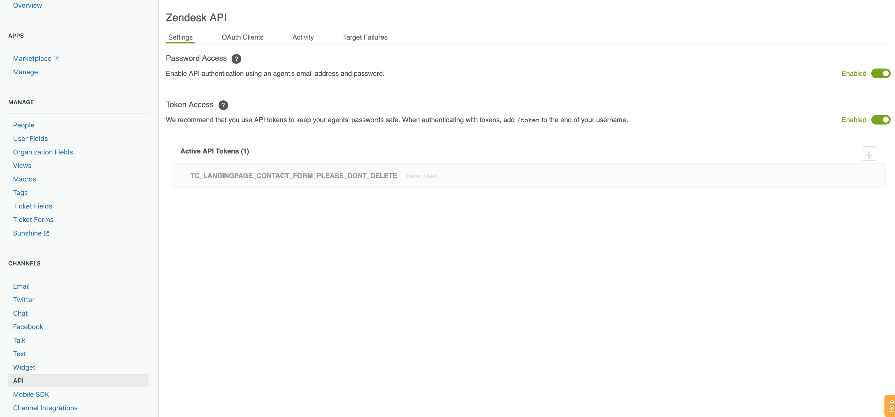

# ZendeskRateThrottlingPrototype
Contains proof of concept on how we can proactively throttle Zendesk API to ensure
a certain minimum desired quota is always available.

# Installation

Download [zip file](https://github.com/abhitopia/ZendeskRateThrottllingPrototype/archive/master.zip)
or use git if you are comfortable. It needs Python 3 to be installed.

```bash
cd ZendeskRateThrottllingPrototype
pip install .
```

# Help
Above will install a command line utility called `zdrt`. For list of command line parameters, run following command
```bash
zdrt --help
```


# Background
Every response to an API call made to Zendesk returns back information about 
total allowed quota as well as remaining quota that minute. 

The header looks like 
```python

header = {
  ...
  'X-Rate-Limit': 700,
  'X-Rate-Limit-Remaining': 699,
  ...
}
```

This information can be used to modulate the Zendesk download by constantly monitoring
remaining quota for that minute.

# Use Case
Let us assume that the organization in question has a Zendesk API limit of 700 calls per minute.
Furthermore, typically, the internal API usage peaks in the evening (nearly always hitting the rate limit)
while the usage is lower during morning hours.

The usage pattern may look like this.


As can be seen, the average usage is 272 only. However the usage peaks at certain
hours (around 6 PM).

Suppose a third party who has access to the API wishes to make API calls while ensuring that
internal operations of the organization in consideration are not disrupted.

This third party can employ a simple strategy to ensure maximal quota utilization while leaving sufficient quota for internal operations to run smoothly.

Third party can make repeated calls to Zendesk API (say to download ticket data). For each call made, 
third party closely monitors remaining quota. If the quota falls below a certain predefined threshold (say `min-remaining-allowance`, 
third party waits for predefined period of time (call this value `retry-after-mins`)
before trying again. 

### Example
Let us suppose
```
min-remaining-allowance=200 # If the quota falls below this level, stop
retry-after-mins=5 # wait for 5 mins before retry
```  

In this case, during peaks hours when the internal usage is highest,
this strategy will make 1 call, and wait for 5 minutes before trying again.

However, during less busy hours when the internal usage is around, say 300 request per minute,
third party can utilize (700-300-200 = 200) requests per minute.

If for whatever, unforeseen reason, this fluctuates and internal usage goes up again, 
then with at most one extra request, the system will adapt and wait another 5 minutes.


### Test
I have created a simple command line utility in python to test this strategy in 
supervised monitored setting. In order to use this utility, you must enable password access to Zendesk API. This can be done temporarily for testing purposes, and safely disabled at a later time.



Typical experiment could be like

```console
$ zdrt --subdomain r**tg**mes -username dje***s@r**tg**mes.com --password ******** --retry-after-mins 5 --min-remaining-allowance 100

Sub-domain: r**tg**mes
URL: https://r**tg**mes.zendesk.com/api/v2/users/me.json
Quota: 200 per minute
Repeated calls with me made to https://help-at-trueai.zendesk.com/api/v2/users/me.json.
However, if the remaining quota per minute falls below 100, the program will sleep for 5 minutes before trying again
You can terminate anytime by pressing Ctrl-C

Call at 2019-07-12 01:13:12.382489 | Quota Remaining: 198
Call at 2019-07-12 01:13:12.749303 | Quota Remaining: 197
Call at 2019-07-12 01:13:13.428832 | Quota Remaining: 196
Call at 2019-07-12 01:13:13.749608 | Quota Remaining: 195
Call at 2019-07-12 01:13:14.089266 | Quota Remaining: 194
Call at 2019-07-12 01:13:14.449294 | Quota Remaining: 193
Call at 2019-07-12 01:13:14.792407 | Quota Remaining: 192
Call at 2019-07-12 01:13:15.137242 | Quota Remaining: 191
Call at 2019-07-12 01:13:15.501402 | Quota Remaining: 190
Call at 2019-07-12 01:13:15.833295 | Quota Remaining: 189
Call at 2019-07-12 01:13:16.153390 | Quota Remaining: 188
Call at 2019-07-12 01:13:16.477231 | Quota Remaining: 187
Call at 2019-07-12 01:13:16.825016 | Quota Remaining: 186
Call at 2019-07-12 01:13:17.185513 | Quota Remaining: 185
Call at 2019-07-12 01:13:17.517269 | Quota Remaining: 184
Call at 2019-07-12 01:13:17.873402 | Quota Remaining: 183
Call at 2019-07-12 01:13:18.221350 | Quota Remaining: 182
Call at 2019-07-12 01:13:18.541421 | Quota Remaining: 181
Call at 2019-07-12 01:13:18.861426 | Quota Remaining: 180
Call at 2019-07-12 01:13:19.193312 | Quota Remaining: 179
Call at 2019-07-12 01:13:19.529274 | Quota Remaining: 178
Call at 2019-07-12 01:13:19.845228 | Quota Remaining: 177
Call at 2019-07-12 01:13:20.498947 | Quota Remaining: 176
Call at 2019-07-12 01:13:20.842701 | Quota Remaining: 175
Call at 2019-07-12 01:13:21.200668 | Quota Remaining: 174
Call at 2019-07-12 01:13:21.513226 | Quota Remaining: 173
Call at 2019-07-12 01:13:21.809794 | Quota Remaining: 172
Call at 2019-07-12 01:13:22.137944 | Quota Remaining: 171
Call at 2019-07-12 01:13:22.743260 | Quota Remaining: 170
Call at 2019-07-12 01:13:23.097014 | Quota Remaining: 169
Call at 2019-07-12 01:13:23.421196 | Quota Remaining: 168
Call at 2019-07-12 01:13:23.753300 | Quota Remaining: 167
Call at 2019-07-12 01:13:24.077391 | Quota Remaining: 166
Call at 2019-07-12 01:13:24.409370 | Quota Remaining: 165
Call at 2019-07-12 01:13:24.741450 | Quota Remaining: 164
Call at 2019-07-12 01:13:25.075047 | Quota Remaining: 163
Call at 2019-07-12 01:13:25.385317 | Quota Remaining: 162
Call at 2019-07-12 01:13:25.705363 | Quota Remaining: 161
Call at 2019-07-12 01:13:26.020197 | Quota Remaining: 160
Call at 2019-07-12 01:13:26.573386 | Quota Remaining: 159
Call at 2019-07-12 01:13:26.877216 | Quota Remaining: 158
Call at 2019-07-12 01:13:27.195750 | Quota Remaining: 157
Call at 2019-07-12 01:13:27.537349 | Quota Remaining: 156
Call at 2019-07-12 01:13:27.861547 | Quota Remaining: 155
Call at 2019-07-12 01:13:28.188002 | Quota Remaining: 154
Call at 2019-07-12 01:13:28.509362 | Quota Remaining: 153
Call at 2019-07-12 01:13:28.848798 | Quota Remaining: 152
Call at 2019-07-12 01:13:29.191117 | Quota Remaining: 151
Call at 2019-07-12 01:13:29.525413 | Quota Remaining: 150
Call at 2019-07-12 01:13:30.096884 | Quota Remaining: 149
Call at 2019-07-12 01:13:30.433131 | Quota Remaining: 148
Call at 2019-07-12 01:13:30.776444 | Quota Remaining: 147
Call at 2019-07-12 01:13:31.113136 | Quota Remaining: 146
Call at 2019-07-12 01:13:31.449346 | Quota Remaining: 145
Call at 2019-07-12 01:13:31.765474 | Quota Remaining: 144
Call at 2019-07-12 01:13:32.093361 | Quota Remaining: 143
Call at 2019-07-12 01:13:32.437256 | Quota Remaining: 142
Call at 2019-07-12 01:13:33.089841 | Quota Remaining: 141
Call at 2019-07-12 01:13:33.437274 | Quota Remaining: 140
Call at 2019-07-12 01:13:33.794766 | Quota Remaining: 139
Call at 2019-07-12 01:13:34.113384 | Quota Remaining: 138
Call at 2019-07-12 01:13:34.453282 | Quota Remaining: 137
Call at 2019-07-12 01:13:34.785277 | Quota Remaining: 136
Call at 2019-07-12 01:13:35.101452 | Quota Remaining: 135
Call at 2019-07-12 01:13:35.444989 | Quota Remaining: 134
Call at 2019-07-12 01:13:36.054543 | Quota Remaining: 133
Call at 2019-07-12 01:13:36.421328 | Quota Remaining: 132
Call at 2019-07-12 01:13:36.784963 | Quota Remaining: 131
Call at 2019-07-12 01:13:37.106738 | Quota Remaining: 130
Call at 2019-07-12 01:13:37.453139 | Quota Remaining: 129
Call at 2019-07-12 01:13:37.789219 | Quota Remaining: 128
Call at 2019-07-12 01:13:38.113342 | Quota Remaining: 127
Call at 2019-07-12 01:13:38.461332 | Quota Remaining: 126
Call at 2019-07-12 01:13:38.805347 | Quota Remaining: 125
Call at 2019-07-12 01:13:39.137966 | Quota Remaining: 124
Call at 2019-07-12 01:13:39.477218 | Quota Remaining: 123
Call at 2019-07-12 01:13:39.785365 | Quota Remaining: 122
Call at 2019-07-12 01:13:40.133280 | Quota Remaining: 121
Call at 2019-07-12 01:13:40.461250 | Quota Remaining: 120
Call at 2019-07-12 01:13:40.785152 | Quota Remaining: 119
Call at 2019-07-12 01:13:41.105445 | Quota Remaining: 118
Call at 2019-07-12 01:13:41.425230 | Quota Remaining: 117
Call at 2019-07-12 01:13:41.754066 | Quota Remaining: 116
Call at 2019-07-12 01:13:42.406162 | Quota Remaining: 115
Call at 2019-07-12 01:13:42.741258 | Quota Remaining: 114
Call at 2019-07-12 01:13:43.077374 | Quota Remaining: 113
Call at 2019-07-12 01:13:43.401421 | Quota Remaining: 112
Call at 2019-07-12 01:13:43.749340 | Quota Remaining: 111
Call at 2019-07-12 01:13:44.308358 | Quota Remaining: 110
Call at 2019-07-12 01:13:44.649653 | Quota Remaining: 109
Call at 2019-07-12 01:13:44.993275 | Quota Remaining: 108
Call at 2019-07-12 01:13:45.303241 | Quota Remaining: 107
Call at 2019-07-12 01:13:45.637230 | Quota Remaining: 106
Call at 2019-07-12 01:13:45.993194 | Quota Remaining: 105
Call at 2019-07-12 01:13:46.345088 | Quota Remaining: 104
Call at 2019-07-12 01:13:46.665243 | Quota Remaining: 103
Call at 2019-07-12 01:13:47.046113 | Quota Remaining: 102
Call at 2019-07-12 01:13:47.381245 | Quota Remaining: 101
Call at 2019-07-12 01:13:47.701181 | Quota Remaining: 100
Quota allowance hit. Sleeping for 5 minutes.
```

**Note**: Please only run this command while monitoring your API usage in Zendesk platform.
If at any point, the usage goes beyond comfortable level, press `ctrl-c` to terminate the command.


Additionally, the organization can use this utility to find acceptable values of
`min-remaining-allowance` and `retry-after-mins`


